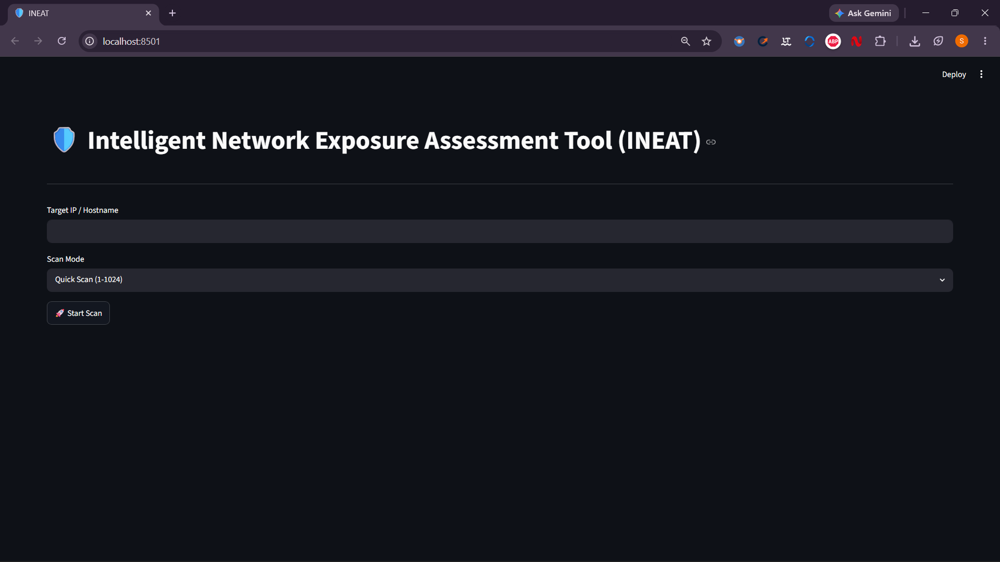
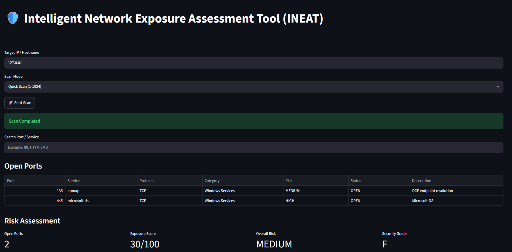
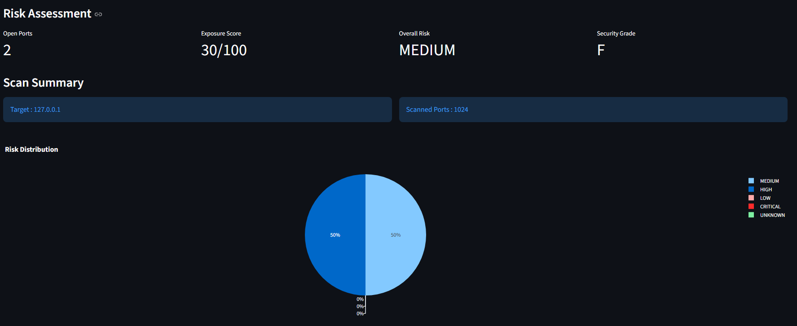
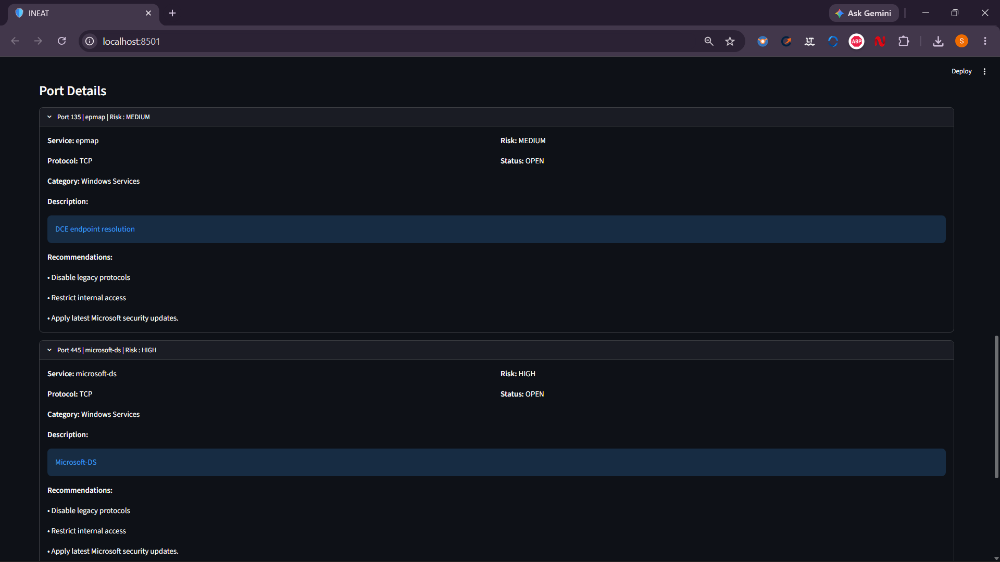
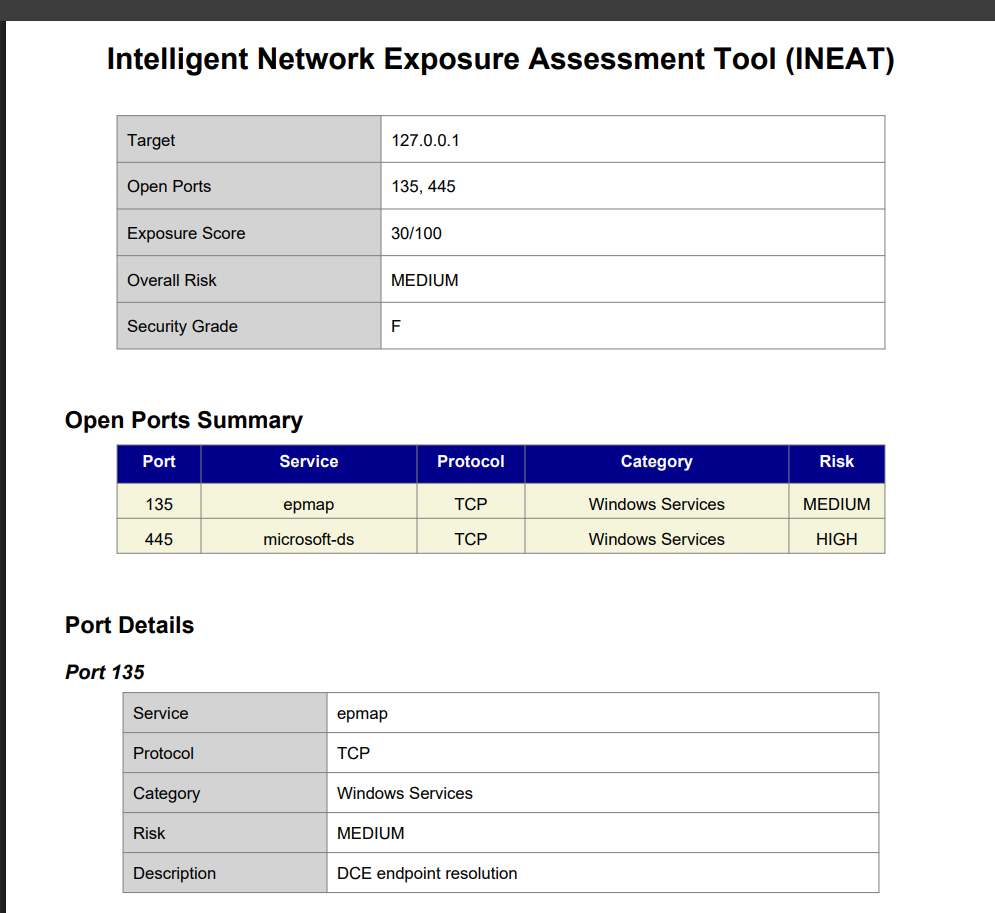

# 🛡️ Intelligent Network Exposure Assessment Tool (INEAT)

A Python and Streamlit-based cybersecurity application designed to identify network exposure by scanning TCP ports, detecting running services, assessing security risks, and generating professional PDF security reports.

---

## 📖 Overview

The Intelligent Network Exposure Assessment Tool (INEAT) is a lightweight network security assessment tool that enables users to analyze hosts for exposed TCP ports and associated services. The application combines official IANA port information with a custom security knowledge base to provide risk assessment, service categorization, security recommendations, exposure analysis, and downloadable PDF reports through an interactive Streamlit dashboard.

---

## ✨ Features

- TCP Port Scanning
- Multi-threaded Scanning Engine
- Hostname & IP Address Validation
- Multiple Scan Modes
  - Quick Scan (1–1024)
  - Standard Scan (1–10000)
  - Full Scan (1–65535)
  - Custom Scan
- Service Detection using IANA Port Database
- Custom INEAT Security Knowledge Base
- Risk Assessment Engine
- Security Grade Calculation
- Exposure Score Calculation
- Service Categorization
- Security Recommendations
- Change Detection
- Exposure Trend Analysis
- Interactive Streamlit Dashboard
- Search and Filter Open Ports
- Interactive Risk Distribution Chart
- Professional PDF Report Generation
- PDF Download Support
- Scan History

---

## 🏗️ Project Architecture

```
                User
                  │
                  ▼
         Streamlit Dashboard
                  │
                  ▼
        Port Scanning Engine
                  │
       ┌──────────┴──────────┐
       ▼                     ▼
 IANA Dataset         INEAT Dataset
       │                     │
       └──────────┬──────────┘
                  ▼
          Service Detection
                  ▼
          Risk Assessment
                  ▼
    Recommendations Engine
                  ▼
      PDF Report Generator
                  ▼
           Download Report
```

---

## 📂 Project Structure

```
INEAT
│
├── dashboard
│   └── app.py
│
├── scanner
│   ├── port_scanner.py
│   ├── validator.py
│   ├── services.py
│   ├── service_loader.py
│   ├── risk_engine.py
│   ├── recommendation_engine.py
│   ├── security_grade.py
│   ├── exposure_trend.py
│   ├── change_detection.py
│   ├── history_view.py
│   ├── pdf_report.py
│   └── config.py
│
├── database
│   ├── database.py
│   └── history.py
│
├── data
│   ├── service-names-port-numbers.csv
│   └── ineat_services.csv
│
├── reports
│
├── screenshots
│
├── main.py
├── requirements.txt
└── README.md
```

---

## 🛠️ Technologies Used

### Programming Language

- Python 3

### Framework

- Streamlit

### Libraries

- Socket
- Concurrent Futures
- Pandas
- Plotly
- ReportLab
- SQLite3

### Database

- SQLite

### Data Sources

- IANA Service Names and Port Numbers
- Custom INEAT Security Dataset

---

## ⚙️ Installation

Clone the repository.

```bash
git clone https://github.com/Sravankumar63/INEAT.git
```

Navigate to the project folder.

```bash
cd INEAT
```

Install dependencies.

```bash
pip install -r requirements.txt
```

---

## ▶️ Running the Project

### Command Line Version

```bash
python main.py
```

### Streamlit Dashboard

```bash
streamlit run dashboard/app.py
```

---

## 📊 Dashboard Features

The dashboard provides:

- Target Host Input
- Scan Mode Selection
- Open Ports Table
- Risk Assessment
- Exposure Score
- Security Grade
- Risk Distribution Chart
- Security Recommendations
- Port Details
- Change Detection
- PDF Report Download

---

## 📄 PDF Report

The generated PDF report includes:

- Scan Summary
- Open Ports Summary
- Port Details
- Service Information
- Risk Assessment
- Recommendations
- Security Summary

---

## 📸 Screenshots

### Dashboard



### Scan Results



### Risk Assessment



### Port Details



### PDF Report



---

## 🚀 Future Enhancements

- UDP Port Scanning
- OS Detection
- Banner Grabbing
- CVE Integration
- Vulnerability Database Integration
- Export to CSV/Excel
- Authentication
- Scheduled Scans
- Email Report Delivery
- REST API Support

---

## 🎯 Applications

- Network Exposure Assessment
- Security Auditing
- Cybersecurity Learning
- Internal Network Assessment
- Educational Demonstrations
- Security Research

---

## 👨‍💻 Author

**Sravan Kumar**

GitHub: https://github.com/Sravankumar63

---

## 📜 License

This project is licensed under the MIT License.

---

## ⭐ Support

If you found this project useful, consider giving it a ⭐ on GitHub.
